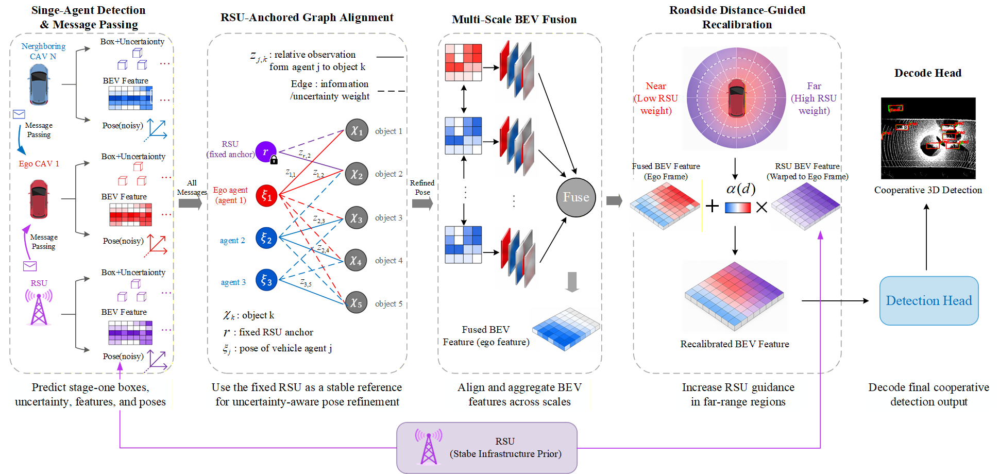
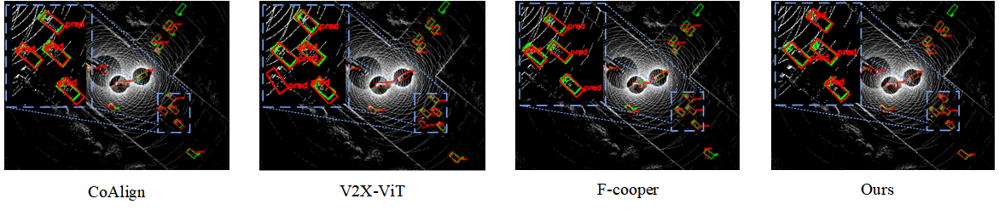

# RDU-CoAlign

This repository is based on [CoAlign](https://github.com/yifanlu0227/CoAlign), an OpenCOOD-based framework for robust collaborative 3D object detection under pose errors. This project keeps the original CoAlign LiDAR collaborative perception pipeline and adds RDU-CoAlign, a PointPillar-based CoAlign variant with semantic enhancement and RSU distance-guided refinement.

## Highlights

- LiDAR collaborative 3D object detection with pose noise simulation.
- CoAlign-style box alignment using precomputed stage-1 boxes.
- RDU-CoAlign model:
  - multiscale AttFusion backbone,
  - hybrid V2XViT-Deform semantic enhancement,
  - RSU distance guidance for far-range feature refinement.
- Dataset yaml support for OPV2V, V2X-Sim 2.0, DAIR-V2X-C, and V2XSet.

## Model Overview



RDU-CoAlign extends CoAlign with a semantic enhancement branch and an RSU distance-guided refinement branch while retaining the original box-alignment workflow for pose-error robustness.

## Installation

The installation is mostly the same as CoAlign/OpenCOOD. You can refer to the original [CoAlign installation instructions](https://github.com/yifanlu0227/CoAlign#installation) for environment details and dependency notes. A typical setup is:

```bash
conda create -n opencood python=3.7 -y
conda activate opencood
pip install -r requirements.txt
python setup.py develop
```

Install CUDA-compatible PyTorch, spconv, and other GPU-specific dependencies according to your local CUDA version. If you use V2X-Sim or DAIR-V2X-C, follow the original CoAlign/OpenCOOD data preparation instructions for their extra metadata and complemented annotations.

## Data Preparation

Create a `dataset` folder under the repository root and place datasets in the following layout. Only the datasets you use are required.

```text
CoAlign/
|-- dataset/
|   |-- OPV2V/
|   |   |-- train/
|   |   |-- validate/
|   |   `-- test/
|   |-- V2XSET/
|   |   |-- train/
|   |   |-- validate/
|   |   `-- test/
|   |-- my_dair_v2x/
|   |   `-- v2x_c/
|   |       `-- cooperative-vehicle-infrastructure/
|   |-- v2xsim2-complete/
|   `-- v2xsim2_info/
|       |-- v2xsim_infos_train.pkl
|       |-- v2xsim_infos_val.pkl
|       `-- v2xsim_infos_test.pkl
```

CoAlign box alignment requires precomputed stage-1 boxes. The yaml files expect them under:

```text
opencood/logs/coalign_precalc/<dataset>/
|-- train/stage1_boxes.json
|-- val/stage1_boxes.json
`-- test/stage1_boxes.json
```

You can either download the original CoAlign precalculation files or generate them with:

```bash
python opencood/tools/pose_graph_pre_calc.py \
  -y opencood/hypes_yaml/v2xset/lidar_only_with_noise/coalign/precalc.yaml
```

## Training

Train with a yaml file:

```bash
python opencood/tools/train.py \
  -y opencood/hypes_yaml/v2xset/lidar_only_with_noise/rdu_coalign/e4_rdu_coalign_full.yaml
```

Resume from an existing log directory:

```bash
python opencood/tools/train.py \
  -y opencood/hypes_yaml/v2xset/lidar_only_with_noise/rdu_coalign/e4_rdu_coalign_full.yaml \
  --model_dir opencood/logs/<experiment_dir>
```

The training script writes checkpoints and copied configs to `opencood/logs/<experiment_name>`.

## Inference and Evaluation

Run standard inference:

```bash
python opencood/tools/inference.py \
  --model_dir opencood/logs/<experiment_dir> \
  --fusion_method intermediate
```

Run distance-bucket evaluation for near/mid/far analysis:

```bash
python opencood/tools/inference_distance_buckets.py \
  --model_dir opencood/logs/<experiment_dir> \
  --fusion_method intermediate \
  --dist_bins 0,30,60,1e8 \
  --bucket_names 0_30m,30_60m,60m_plus
```

Example BEV detection comparison:



## YAML Configuration Guide

All training and evaluation settings are controlled by yaml files under `opencood/hypes_yaml`. The path pattern is:

```text
opencood/hypes_yaml/<dataset>/<modality_or_noise_setting>/<method>/<config>.yaml
```

Common datasets and groups:

- `opencood/hypes_yaml/v2xset/lidar_only_with_noise/coalign/`: original CoAlign and related V2XSet variants.
- `opencood/hypes_yaml/v2xset/lidar_only_with_noise/rdu_coalign/`: RDU-CoAlign and compact V2XSet ablation configs.
- `opencood/hypes_yaml/opv2v/lidar_only_with_noise/rdu_coalign/`: OPV2V RDU-CoAlign config.
- `opencood/hypes_yaml/dairv2x/lidar_only_with_noise/rdu_coalign/`: DAIR-V2X-C RDU-CoAlign config.
- `opencood/hypes_yaml/v2xsim/lidar_only_with_noise/rdu_coalign/`: V2X-Sim 2.0 RDU-CoAlign config.

Important yaml blocks:

- `root_dir`, `validate_dir`, `test_dir`: dataset split locations.
- `noise_setting`: pose noise used for training or evaluation.
- `fusion`: dataset name and cooperative fusion mode.
- `box_align`: precomputed stage-1 box paths and CoAlign pose correction options.
- `preprocess` and `postprocess`: voxelization range, anchors, targets, and NMS settings.
- `model`: detector and fusion model. RDU-CoAlign uses `core_method: point_pillar_rdu_coalign`.
- `hybrid_v2xvit_deform`: semantic enhancement branch.
- `rsu_distance_guidance`: RSU distance-guided feature refinement branch.

The V2XSet ablation yaml files are named from `e0` to `e5` and each file starts with comments listing the enabled and disabled modules. The full RDU-CoAlign config is:

```text
opencood/hypes_yaml/v2xset/lidar_only_with_noise/rdu_coalign/e4_rdu_coalign_full.yaml
```

## Citation

If you use the original CoAlign code or compare against CoAlign, please cite:

```bibtex
@inproceedings{lu2023robust,
  title={Robust collaborative 3d object detection in presence of pose errors},
  author={Lu, Yifan and Li, Quanhao and Liu, Baoan and Dianati, Mehrdad and Feng, Chen and Chen, Siheng and Wang, Yanfeng},
  booktitle={2023 IEEE International Conference on Robotics and Automation (ICRA)},
  pages={4812--4818},
  year={2023},
  organization={IEEE}
}
```

## Acknowledgement

This project builds on CoAlign and OpenCOOD. Thanks to the authors and contributors of [CoAlign](https://github.com/yifanlu0227/CoAlign), [OpenCOOD](https://github.com/DerrickXuNu/OpenCOOD), g2opy, and d3d.
